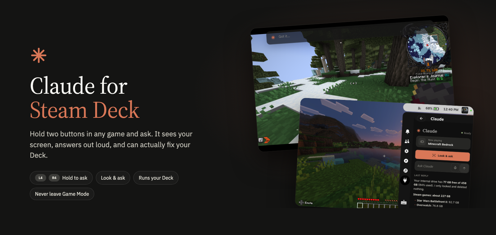
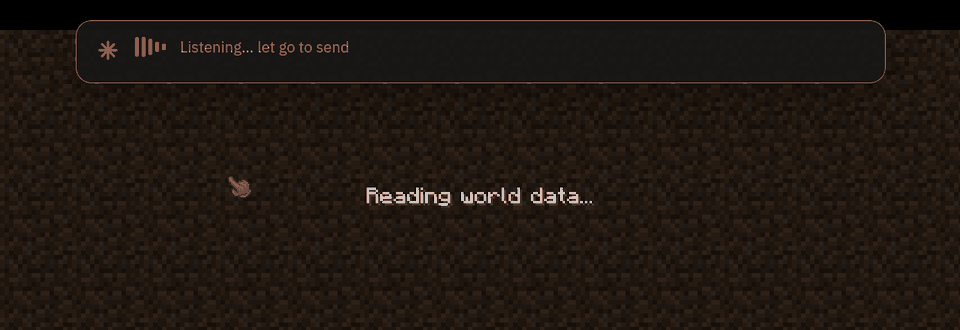
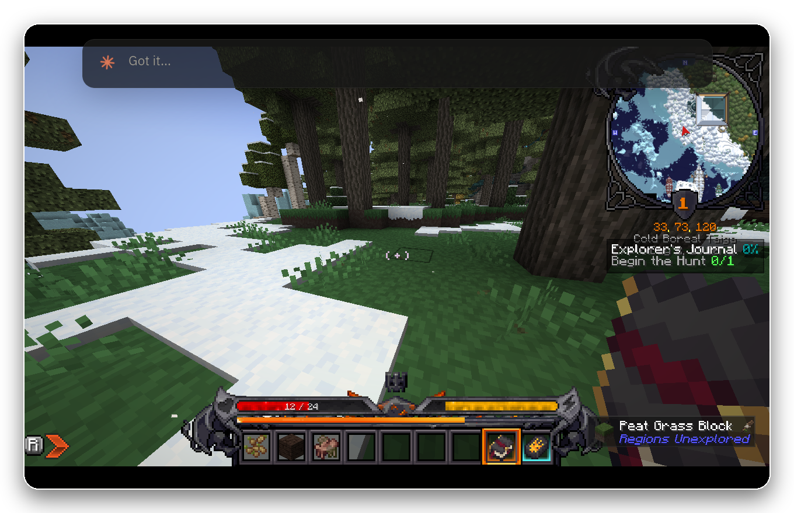
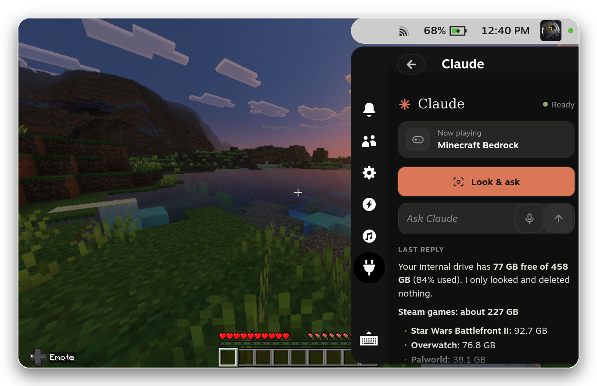
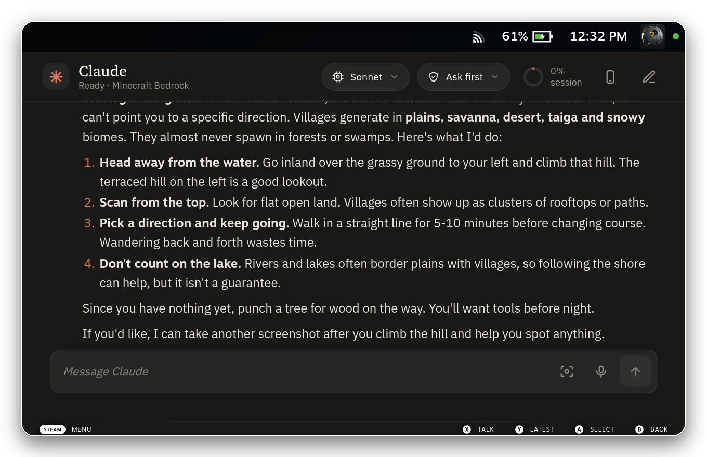
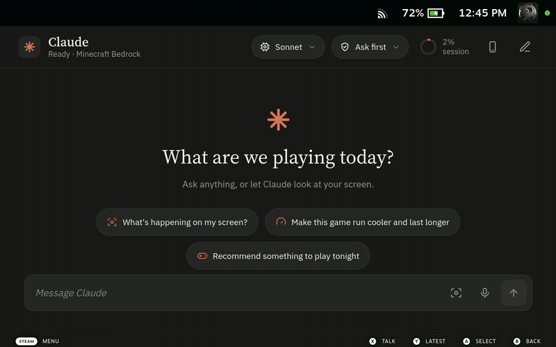
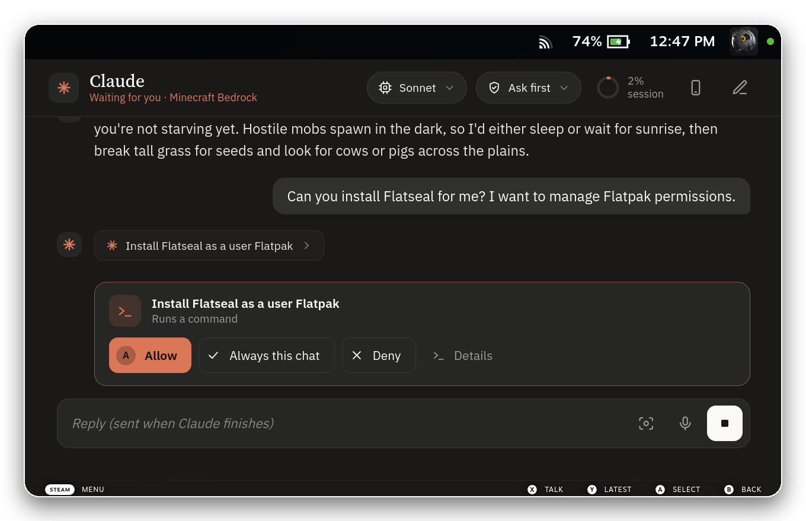
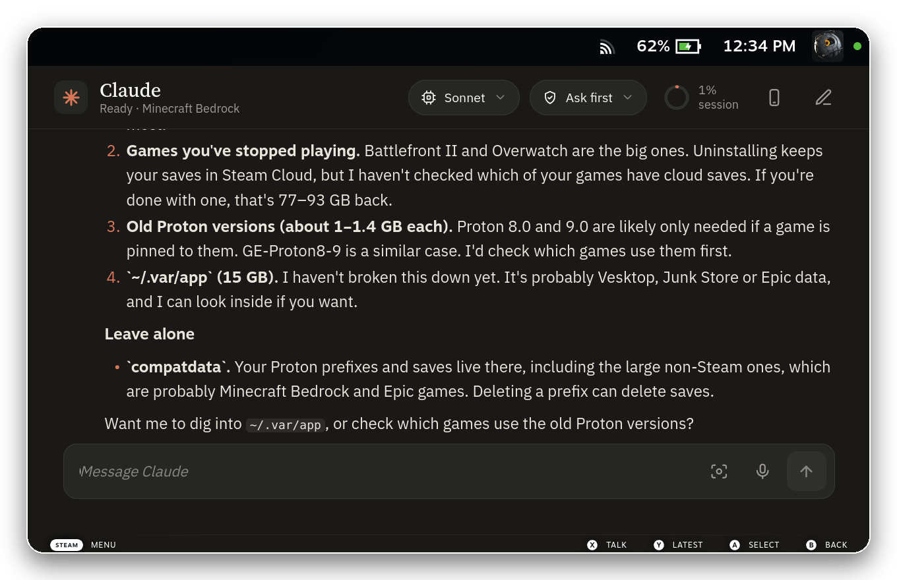
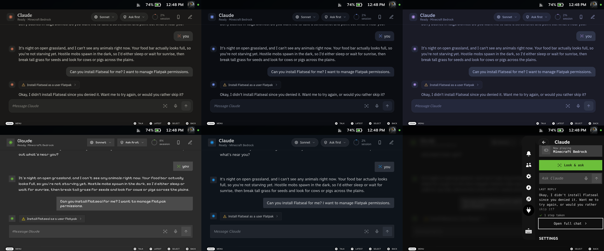
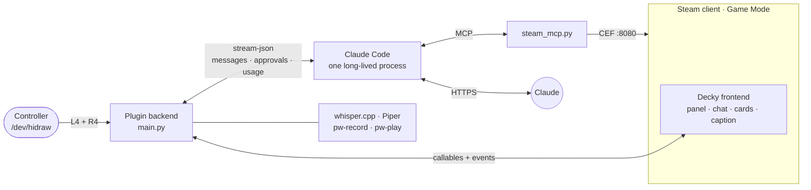

<p align="center">
  
</p>

<p align="center">
  <a href="LICENSE"></a>
  
  
  
  
</p>

<p align="center">
  <a href="#install">Install</a> ·
  <a href="#hold-to-ask-anywhere">Hold to ask</a> ·
  <a href="#what-you-can-ask">What you can ask</a> ·
  <a href="#youre-in-charge">Safety</a> ·
  <a href="#how-it-works">How it works</a> ·
  <a href="#faq">FAQ</a>
</p>

---

You're forty minutes into a boss fight, or lost in a modpack, or your game just crashed on launch.
Normally that means pausing, pulling out your phone, searching, and squinting at a wiki.

**With this plugin you hold L4 + R4 and ask.** Claude sees what's on your screen, answers in a caption
over the game, and says it out loud. And because it's [Claude Code](https://code.claude.com) running on
your Deck, it doesn't just tell you what to do: it can change the FPS cap, switch the Proton version,
install the mod, read the crash log, and back up your saves first.

All without ever touching Desktop Mode.

<p align="center">
  
</p>

---

## Hold to ask, anywhere



Hold **L4 + R4** in any game. Claude grabs the screen the moment you press, listens while you hold, and
answers when you let go:

> **"Where do I go from here?"** · **"What does this sign say?"** · **"How do I beat this guy?"** ·
> **"Why is my FPS tanking?"**

The caption fades on its own once it's been read (or spoken). Press the shortcut again to dismiss it and
stop the voice. Your game keeps control the whole time: the plugin *reads* the controller alongside
Steam; nothing is remapped or intercepted.

**Make the buttons yours.** Settings › *Hold to ask* and *Hold to dictate*:

| Preset | Notes |
|---|---|
| **L4 + R4** (default) | Upper back buttons, unused by almost every game |
| **L5 + R5** (default for dictation) | Lower back buttons |
| L4 + L5 · R4 + R5 | One side of the Deck, one hand |
| L4 · R4 · L5 · R5 | A single back button |
| View + Menu · both stick clicks · both trackpad clicks | Work too, but the game also sees those presses |
| **Record new combo…** | Hold any buttons for a second and they become the shortcut |

**Dictation:** hold **L5 + R5** and whatever you say is typed into the text box you're in: Steam
search, chat, a game's name field.

## Look & ask



The same thing from the Quick Access menu: press **Look & ask**, the menu slides away, the game is
captured, and the mic opens. The panel also shows what's playing, Claude's last reply, your plan usage,
and every setting.



## It talks back

<p align="center"></p>

Ask by voice and Claude answers out loud, starting with the first sentence while the rest is still
being written. Spoken replies are kept short and skip code. Both directions run **on the Deck**:

- **Listening:** [whisper.cpp](https://github.com/ggml-org/whisper.cpp), tuned for the Deck's CPU
  (about a second for a short question, measured with a game running).
- **Speaking:** [Piper](https://github.com/rhasspy/piper), a natural neural voice.
- Sound captions that game audio produces, like *(footsteps)* or *[music]*, are filtered out, so the
  game can't ask questions on your behalf.

**[▶ Watch the voice demo with sound](docs/media/video/voice-demo.mp4)** · Set *Spoken replies* to
*When I talk*, *Always* or *Off*.

## What you can ask

Claude has real tools on your Deck, not just a chat window:

| You say | Claude can |
|---|---|
| "Make this game run cooler and last longer" | Read the current profile, then set the FPS cap, refresh rate and TDP for that game |
| "This keeps crashing on launch" | Read the Proton logs, look up known fixes, try another Proton version (after backing up saves) |
| "Install performance mods for this pack" | Find them, install them, adjust memory and Java, and tell you what changed |
| "How much space are my games using?" | Measure every library folder and suggest what's safe to clear |
| "Back up my saves every night" | Schedule a job that keeps the Deck awake only while it runs |
| "Sign me in to Heroic" | Show a QR code and code right in the chat; passwords go to a private file Claude never reads |
| "What should I play tonight?" | Look through your library and playtime, and pick something |

Every message quietly includes the running game, battery and performance settings, so "this game"
just works. Claude also keeps a short **notes file per game** (where you're stuck, which mods and
settings worked) and reads it the next time you ask about that game.

## You're in charge



Anything that changes your system asks first, with an **Allow / Always this chat / Deny** card you
answer with the controller. What Claude is about to do is written in plain English; the exact command
is behind **Details**. Choose how much it may do on its own:

| Mode | What happens |
|---|---|
| **Ask first** (default) | Looking around is free; anything else gets a card |
| **Accept edits** | File edits go through; commands still ask |
| **Plan first** | Claude looks around, then shows a plan for you to approve |
| **Auto** | Claude Code's safety check approves routine actions; risky ones still ask |
| **Full trust** | Nothing asks (hard blocks still apply) |

**Hard blocks, in every mode:** `sudo` and other root access · unlocking SteamOS's read-only
partition · formatting or partitioning disks · deleting your home folder · reading your SSH keys,
Claude's credentials or the sign-in secrets folder.

**Always asks** (outside Full trust): deleting files, stopping services, killing processes,
uninstalling Flatpaks, and Steam scripting that uninstalls things or changes settings.

**Saves come first:** before changing a game's Proton version, installing mods or deleting its files,
Claude snapshots the saves and can put them back. Games with anti-cheat are off limits for file changes.

## A clean conversation



No walls of shell commands. The work Claude does between replies collapses into one line
("✓ Measured game and storage usage · 3 steps") that you can expand. Replies are short and written for
a 7-inch screen; long ones scroll a paragraph at a time with the d-pad.

## Built into Steam

- **Ask Claude on every game page:** *Make it run better*, *Fix a problem*, *Mods and tweaks*,
  *Is it worth playing?*, one press from your library.
- **Crash help:** if a game quits within 90 seconds of launching, a notification offers to find out
  why. Nothing is sent unless you tap it.
- **Screenshots:** take one with **Steam + R1**, then tap the notification to ask about it.
- **Low battery:** at 20% mid-game, a notification offers to stretch what's left.
- **Background jobs:** scheduled work shows up under **Jobs** in the panel, where you can cancel it.
- **Chats:** reopen or delete past conversations. With *A chat per game* on, each game gets its own
  thread, so Claude picks up where you left off.
- **Continue on phone:** a QR code opens the same live session in the Claude app.
- **Plan usage:** your 5-hour and weekly limits, with reset times.
- **Model picker:** Default, Fable, Opus, Sonnet or Haiku, switched mid-conversation.

## Themes



**Claude** · **Midnight** · **Tokyo** · **Minecraft** (pixel font, square corners) · **SteamOS**.
Settings › Theme. It applies instantly everywhere: panel, chat, cards and the in-game caption.

---

## Install

**You need**

| | |
|---|---|
| A Steam Deck (LCD or OLED) | in Game Mode |
| [Decky Loader](https://github.com/SteamDeckHomebrew/decky-loader) 3.2.8+ | the plugin loader |
| A Claude account | Pro or Max subscription (or an API key) |

**Then**

1. Download **`claude-deck.zip`** from the [latest release](../../releases/latest).
2. Decky › ⚙ Settings › **Developer** › **Install Plugin from ZIP** (or paste the zip's URL into
   *Install Plugin from URL*).
3. Open Quick Access › **Claude**. A **Finish setting up** card walks you through the rest, without
   Desktop Mode:
   - **Install Claude Code** (one tap, official installer)
   - **Sign in** (scan a QR code with your phone, paste the code back)
   - **Set up voice** (optional, about 250 MB: Piper, a voice, and the Whisper model)

When a new version is released, an **Update** button appears in Settings.

> The official Decky store doesn't list AI plugins, so releases live here on GitHub.

<details>
<summary><b>Prefer the terminal?</b></summary>

```bash
curl -fsSL https://claude.ai/install.sh | bash   # Claude Code for the deck user
~/.local/bin/claude                               # sign in once
bash scripts/setup-voice.sh                       # optional: voice, no root needed
```
</details>

---

## How it works



<details>
<summary><b>Under the hood</b></summary>

- **One Claude Code process** stays alive in bidirectional `stream-json` mode, so replies start fast,
  **Stop** interrupts cleanly, and the model or mode can change mid-chat. Permission requests arrive as
  `can_use_tool` control messages and become cards; a `PreToolUse` hook callback enforces the hard
  blocks. Busy state follows the CLI's echoes of queued messages, which it can merge into one turn.
- **Hold to ask** reads the controller's HID reports from `/dev/hidraw` (the `deck` user already has
  access), alongside Steam rather than instead of it. Button bits match SDL's Steam Deck driver and
  were checked on a real Deck.
- **The caption over games** is a Decky global component that asks Steam for its *notification*
  composition layer, the same one toasts use: drawn over the game, never taking input.
- **Screenshots** come from gamescope, so Claude sees the game, not the caption. They're re-encoded
  to JPEG and sent inline with your question.
- **Steam tools** (`steam_mcp.py`) run JavaScript in Steam's UI context: list, launch and stop games,
  performance settings, Proton versions, launch options, save backups, and sign-in cards.
- **Voice:** `pw-record` at 16 kHz, whisper.cpp with an audio context sized to the clip, and Piper
  reading the reply line by line through `pw-play` as it streams.
- **Jobs** are transient systemd user units named `claude-*`, wrapped in `systemd-inhibit` while they
  work.
- Nothing touches SteamOS's read-only system. Everything lives in your home folder, so OS updates
  don't break it.

| File | What it is |
|---|---|
| `main.py` | Decky backend: Claude session, approvals, voice, shortcuts, chats, setup, updates |
| `steam_mcp.py` | MCP server with the Steam tools |
| `deck_tools.py` | Screenshots, recording, Whisper, Piper, controller chords |
| `src/index.tsx` | Panel, chat page, caption, Steam hooks |
| `src/asks.tsx` · `src/setup.tsx` · `src/theme.ts` · `src/icons.tsx` | Cards, onboarding, themes, icon set |
| `scripts/deploy.sh` · `scripts/deckctl.py` | Build and install over SSH; drive Game Mode for captures |
</details>

---

## FAQ

<details>
<summary><b>Is this made by Anthropic or Valve?</b></summary>

No. It's an unofficial, community-built plugin. It drives your own installed Claude Code with your own
account; it doesn't ship or handle any login of its own.
</details>

<details>
<summary><b>What does it cost?</b></summary>

The plugin is free and MIT-licensed. Claude usage counts against your Claude plan (Pro or Max) or API
key, the same as using Claude Code anywhere else. The panel shows how much of your plan you've used.
</details>

<details>
<summary><b>Does it work offline?</b></summary>

Listening and speaking run on the Deck, but Claude itself needs an internet connection.
</details>

<details>
<summary><b>Could it get me banned in online games?</b></summary>

It doesn't inject anything into games: it reads the controller alongside Steam, takes screenshots the
way gamescope does, and draws in Steam's own overlay layer. Claude is told to leave the files of
anti-cheat games alone. As with any tool, use common sense.
</details>

<details>
<summary><b>What about battery?</b></summary>

Reading the controller costs a sliver of CPU. One Claude Code process stays open while you chat, and
voice work happens only while you're holding the button or Claude is speaking.
</details>

<details>
<summary><b>Other languages?</b></summary>

Claude understands and answers in your language when you type. The default speech model is
English-only; a multilingual Whisper model and Piper voice are on the roadmap.
</details>

<details>
<summary><b>Can I use it in Desktop Mode?</b></summary>

The plugin lives in Game Mode's Quick Access menu. In Desktop Mode, just run `claude` in a terminal.
</details>

---

## Develop

SteamOS has no Node, so build anywhere and push to the Deck over SSH:

```bash
npm install
DECK_HOST=deck@steamdeck scripts/deploy.sh          # build, copy, reload (waits if Claude is busy)
python3 scripts/deckctl.py shot my-screen            # on the Deck: screenshot with overlays
```

Every image and clip in this README was captured on a real Deck with `scripts/deckctl.py`. Research
notes and the roadmap are in [`docs/`](docs/), and [CONTRIBUTING.md](CONTRIBUTING.md) has the house
rules (controller first, no emoji in the UI, safety rules live in `main.py`).

## Credits

Built by [Ryan Reid](https://github.com/RyanWReid), with Claude. Standing on
[Decky Loader](https://github.com/SteamDeckHomebrew/decky-loader),
[whisper.cpp](https://github.com/ggml-org/whisper.cpp), [Piper](https://github.com/rhasspy/piper),
[qrcode-generator](https://github.com/kazuhikoarase/qrcode-generator), and the Decky plugin community,
especially the plugins that worked out how to read the controller and draw over games.

<sub>Claude is a trademark of Anthropic, PBC. Steam and Steam Deck are trademarks of Valve Corporation.
This project is not affiliated with or endorsed by either. Released under the [MIT License](LICENSE).</sub>
